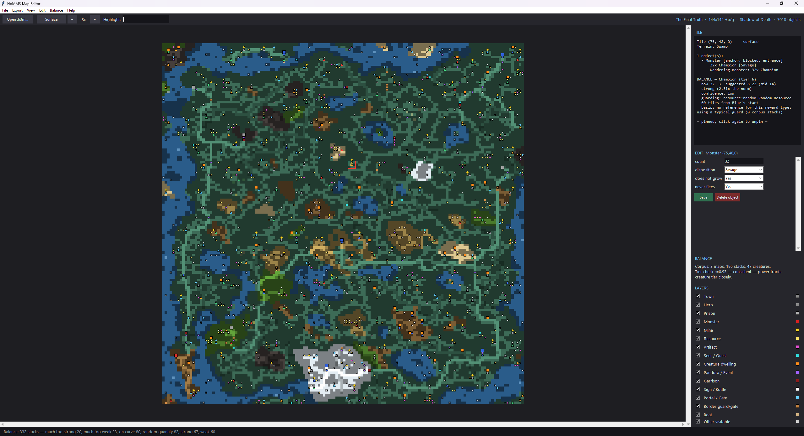
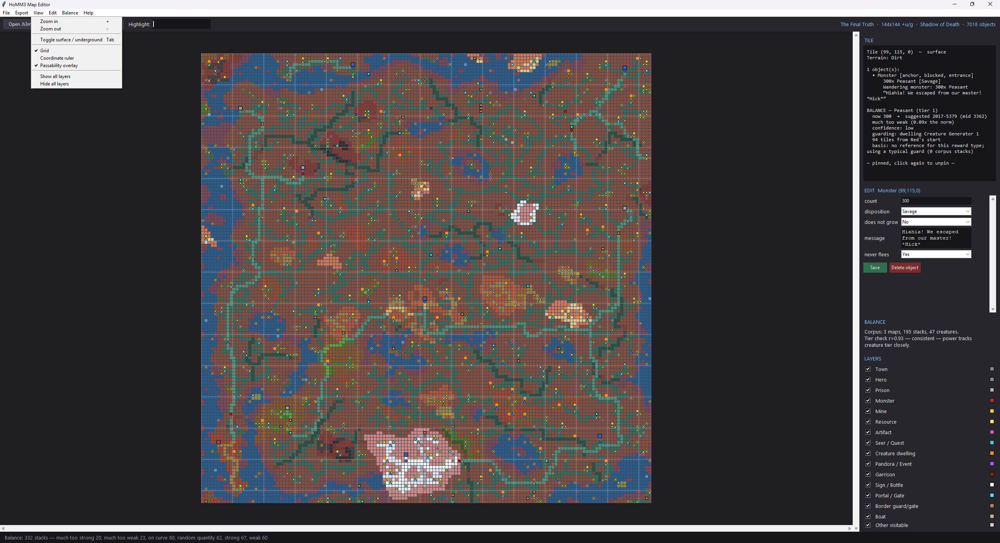
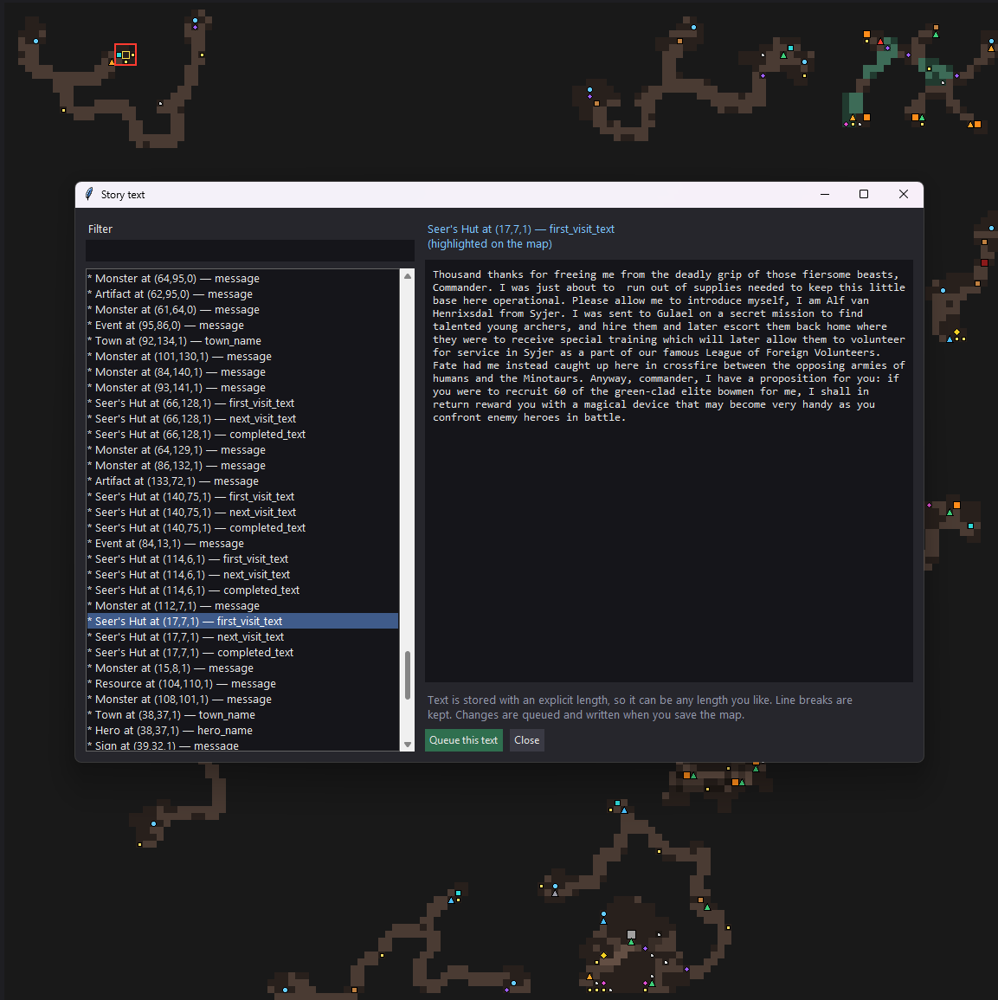
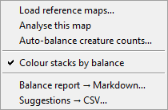
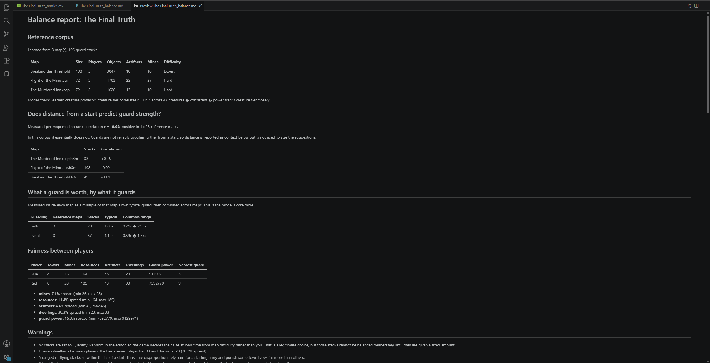
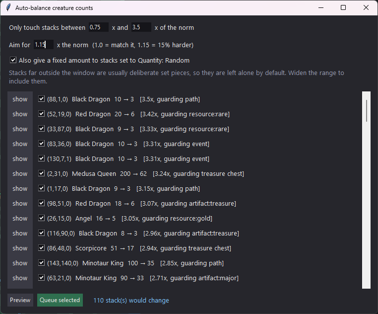
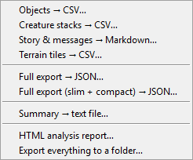

# h3m-toolkit

Read, analyse, balance and edit **Heroes of Might & Magic III** map files
(`.h3m`) — from a desktop GUI or from Python.

Pure Python 3.8+, standard library only. Nothing to install.

```bash
python3 h3m_viewer.py MyMap.h3m     # inspect a map — cannot change it
python3 h3m_editor.py MyMap.h3m     # inspect and edit
python3 h3m.py MyMap.h3m            # command-line summary
```



Hover any tile to see what is on it. Click to pin and edit it. The right-hand
panel shows the tile, the edit fields for whatever is selected, and — once
reference maps are loaded — how that stack compares with the norm.

---

## Contents

- [Install](#install) · [The two programs](#the-two-programs) ·
  [Viewing](#viewing) · [Editing](#editing) · [Story text](#story-text)
- [Balance analysis](#balance-analysis) · [Auto-balance](#auto-balance)
- [Reports and exports](#reports-and-exports) ·
  [Command line](#command-line) · [Limitations](#limitations)

Deeper detail — the binary format, how writing avoids corrupting a file, how
the balance model was built and tested — is in
[**DOCUMENTATION.md**](DOCUMENTATION.md).

---

## Install

Copy the files into a folder and run them.
If you want to check that you can run the program, you can run: 

```bash
python3 setup_check.py        # confirms this machine can run everything
```

### Files

| File | What it is |
|---|---|
| `h3m_viewer.py` | read-only program |
| `h3m_editor.py` | editing program |
| `h3m.py` | parser, editor API and command-line tool |
| `h3m_gui.py` | shared window behind both programs |
| `h3m_render.py` | drawing: palettes, tile index, hover text |
| `h3m_balance.py` | balance model, suggestions, auto-balance |
| `h3m_creatures.py` | reference data: AI values, stats, artifact classes |
| `h3m_army.py` | army composition |
| `h3m_report.py` | HTML and PDF reports |

All nine must sit in the same folder and keep their names — `h3m_render.py`
(drawing) and `h3m_viewer.py` (the program) are different files. Both entry
points check this on launch and name anything missing.

---

## The two programs

They share one window, so hovering, layers and exports behave identically.
The viewer simply has no Edit menu, so a map you only meant to inspect cannot
be changed by accident.

### Viewing



The map draws one pixel per tile and scales up, so a 144×144 map renders
instantly. Roads lighten a tile, rivers darken it, blocked tiles shade down.

- **Hover** for terrain, road/river, every object covering the tile, owner,
  creature stacks and message text — **click** to pin and select
- **Tab** switches surface / underground; **Ctrl + wheel** zooms 1×–16×
- **View menu**: grid, coordinate rulers, and a passability overlay (blocked
  red, interactive yellow). The rulers sit in fixed gutters like the official
  editor's, so numbers never cover terrain
- **Layers** toggles each object category; **Highlight** outlines everything
  matching what you type — "dragon", "gold", "Sharpshooter"

Objects are marked on their *entrance* tile, so a castle's marker sits where a
hero actually walks on.

### Editing

Click a tile to pin it and its fields appear: message text, monster count and
disposition, hero and town names, owner, resource amount. Creature stacks
inside an object — guards, garrisons, hero armies, event rewards — get a
creature dropdown and an amount box each.

**Fill to…** sets a stack's counts to reach a total of hit points or combat
power, spread in proportion to weekly growth so the result reads as an army.
Ask for 10,000 HP of Peasants, Boars and Azure Dragons and you get 220 / 52 /
9, not ten thousand Peasants. A slider tilts the mix toward low or high tiers.

**Delete object** removes an object entirely. **Edit ▸ Pending changes** lists
everything queued with a per-item **undo**. Nothing reaches disk until
**Edit ▸ Save map as…**.

Writing is done by splicing the exact bytes a field occupies rather than
re-serialising the map, and the result is re-parsed in memory before it is
written — a parse failure, trailing bytes or a changed object count aborts the
save. Loading and saving all 19 test maps with no edits reproduces the
original bytes exactly. See
[DOCUMENTATION.md §3](DOCUMENTATION.md) for how and why.

It edits values in place and can delete objects. It cannot add objects, resize
the map or change terrain.

### Story text



**Edit ▸ Story text editor…** lists every string in the map with a filter box.
Selecting an entry scrolls the map to it and highlights it, so you can see
what a sign or quest sits next to while you rewrite it. Text is stored with an
explicit length, so replacements can be any length and line breaks survive.

For bulk work such as translation there is a file round trip:

```bash
python3 h3m.py MyMap.h3m --export-texts texts.json
# …edit the "text" values, leave "id" alone…
python3 h3m.py MyMap.h3m --import-texts texts.json --save MyMap_edited.h3m
```

---

## Balance analysis



Load a few maps you consider well balanced, then **Analyse this map**. Monster
markers recolour by verdict, and hovering a stack shows its suggestion and the
reasoning behind it.

```bash
python3 h3m_balance.py --reference good1.h3m good2.h3m \
                       --analyze mymap.h3m --report balance.md
```

**Creature strength** comes from the game's own AI Values, adjusted for speed
and for ranged and flying traits — AI Value alone rates a Dendroid Soldier
(speed 4) above a Vampire Lord (speed 9, flying), which is not how they play.

**Targets are relative to your own map.** Reference maps of the same size
differ by up to 50× in how large their stacks are, so there is no universal
correct guard strength to impose. What *is* consistent between mapmakers is
the ratio — a relic guard is worth about 3× that map's typical guard, a seer
hut about 0.11×. Those ratios are applied to your map's own typical guard, so
"much too strong" means *large compared with the rest of your map, given what
it guards*.

Each stack gets one target plus a **confidence** label reflecting how much the
reference maps agree. A reward type is used only when at least 3 maps back it.

**What a guard really protects** is worked out by flood-filling the
passability grid with the monster treated as a wall. If it seals a pocket, the
pocket is shaded and its contents circled — often several mines and a dwelling
rather than the one thing nearest it.

**Fairness between players** assigns every object to the nearest start and
compares mines, resources, artifacts, dwellings and guard power. A large
spread is usually a map's biggest balance problem.



### Auto-balance



Resizes stacks toward the norm for what they guard. The key control is the
**window**: a stack at 20× the norm is usually a deliberate set piece, so by
default only stacks between 0.5× and 5× are touched. **Aim for N×** scales
every target, so 1.15 makes the map 15% harder throughout.

Each row has a **show** button that jumps the map to that stack, and a
checkbox to skip it. Queued changes go through the same undo list as any other
edit.

```bash
python3 h3m_balance.py --reference good*.h3m --analyze mymap.h3m \
                       --auto-balance out.h3m --window 0.5 5
```

**Quantity: Random** stacks — set that way in the editor, so the game picks
their size at load time — are reported separately rather than counted as
mistakes. Auto-balance can give them fixed amounts if you tick the option.

---

## Reports and exports



The HTML report is one self-contained file — no server, no assets, no internet
— with an interactive map, terrain donuts, object and monster charts, player
fairness, and full tables for towns, heroes, artifacts, spells, mines,
dwellings, quests, events and more.

**Every table sorts** on any column: numbers numerically, `[x,y,z]` by
coordinate, blanks always last. The **balance table filters live** — two
sliders for the ratio window, plus verdict and text search.

**PDF**: the report has a print stylesheet, so the browser's own Print → Save
as PDF gives the same document on paper (light palette, repeating table
headers, no split rows). There is a *Save as PDF* button in the header, or:

```bash
python3 h3m_report.py MyMap.h3m --pdf report.pdf
python3 h3m_report.py MyMap.h3m --sections map,overview,terrain,balance
```

`--pdf` drives an installed Chrome, Chromium or Edge; if none is found it says
so and points at the browser route. A full report on a large map runs to about
a hundred pages, so `--sections` scopes it — the example above gives 26.
`--list-sections` shows the ids.

Other exports: objects CSV, creature stacks CSV, story text (Markdown or
round-trippable JSON), terrain CSV, and a full tile-keyed JSON export.

---

## Command line

```bash
python3 h3m.py MAP.h3m                       # readable summary
python3 h3m.py MAP.h3m --objects --filter mine
python3 h3m.py MAP.h3m --csv objects.csv --armies armies.csv
python3 h3m.py MAP.h3m --texts story.md --terrain-csv tiles.csv
python3 h3m.py MAP.h3m --export full.json --slim --compact
```

As a library — `h3m.py` works on its own, with no other file present:

```python
from h3m import parse_file

m = parse_file("MyMap.h3m")
print(m["name"], m["size"], m["difficulty"])
for o in m["objects"]:
    print(o["x"], o["y"], o["z"], o["name"], o.get("owner", ""))
```

`x` is the column, `y` the row, `z` is 0 for surface and 1 for underground,
origin top-left. Multi-tile objects are stored at their **bottom-right**
anchor, matching the map editor.

The parser reports how many bytes it left unconsumed. `0` means every field
width was correct from the first byte to the last; anything else means the
parse desynced and the object list past that point is not trustworthy.

---

## Limitations

- **Horn of the Abyss and WoG maps are not supported** — both add fields
  throughout the header. They are rejected with a clear error rather than
  mis-parsed.
- No object creation, map resizing or terrain editing.
- Decorative scenery names are approximate; the `def` sprite name in the
  export is always authoritative. Gameplay object names were cross-checked
  against sprite filenames.
- Creature dwellings are named from their sprite: 73 of 80 subtypes resolve,
  about 95% of dwellings in testing. The rest keep the sprite name rather than
  get a guess.
- Guard-region analysis assumes land movement and ignores boats, teleporters
  and subterranean gates, so a pocket reported as sealed may be reachable
  another way.
- Maps made with modified editors can contain assets the retail game cannot
  load; such a map may parse here yet fail to open in the official editor for
  reasons unrelated to this toolkit.

---

## Credits and licence

Creature AI Values and artifact classes are transcribed from *Tribute to
Strategists* (Rainalkar, 2008); combat stats from the Heroes 3 creature power
chart.

Heroes of Might & Magic III is the property of its respective rights holders.
This is an independent tool that reads and writes map files; it contains no
game assets, and no map files are included here.

MIT Licence — see [LICENSE](LICENSE).
